# RAPT-CLIP-RAER

> **Nhận diện mức độ tham gia học tập bằng biểu diễn đa phương thức từ ảnh và mô tả ngữ nghĩa**

Framework nhận diện cảm xúc học tập (Academic Emotion Recognition) dựa trên kiến trúc **Dual-Stream CLIP** kết hợp **Prompt Learning**, **Temporal Modeling** và **Expression-Aware Adapter**.

---

## 🌟 Tổng Quan Kiến Trúc

```
Input Video
    ├── Face Stream ──→ CLIP ViT-B/16 + Face Adapter ──→ Temporal Transformer ──→ Face Features
    │                                                                               │
    └── Body Stream ──→ CLIP ViT-B/16 ─────────────────→ Temporal Transformer ──→ Body Features
                                                                                    │
                                                                          Feature Fusion (Concat)
                                                                                    │
                                                                            Projection FC ──→ Logits
                                                                                    │
                                                            Cosine Similarity with Text Features (Prompt Learner)
```

### Thành phần chính

| Module | Mô tả |
|--------|-------|
| **CLIP ViT-B/16** | Pretrained vision-language backbone, fine-tune image encoder |
| **Face Adapter (EAA)** | Lightweight adapter cho face stream, giữ pretrained knowledge |
| **Temporal Transformer** | Attention pooling qua thời gian, focus vào "peak" emotion frames |
| **Prompt Learner** | Learnable context vectors + Prompt Ensembling (3 prompts/class) |
| **Hand-crafted Prompts** | Mô tả ngữ nghĩa chi tiết cho từng class cảm xúc |
| **LDAM Loss** | Label-Distribution-Aware Margin Loss cho class imbalance |
| **MI Loss** | Mutual Information — align learnable ↔ hand-crafted prompts |
| **DC Loss** | Decorrelation — giảm redundancy trong feature dimensions |

---

## 📁 Cấu Trúc Thư Mục

```
RAPT-CLIP-RAER/
├── main.py                        # Entry point: train & eval
├── trainer.py                     # Training/validation logic
├── models/
│   ├── Generate_Model.py          # Full RAER model architecture
│   ├── Prompt_Learner.py          # Learnable prompt module
│   ├── Text.py                    # Text prompts & descriptors cho RAER, CAER, CK+, DAiSEE
│   └── clip/                      # CLIP backbone (ViT-B/16)
├── dataloader/
│   ├── video_dataloader.py        # Video dataset & transforms
│   └── video_transform.py         # Custom augmentations
├── utils/
│   ├── builders.py                # Model, dataloader, class info builders
│   ├── loss.py                    # LDAM, MI, DC, LDL losses
│   └── utils.py                   # Metrics, checkpointing, plotting
├── train_sh/                      # Training shell scripts
│   └── ablation/                  # Ablation study scripts
├── RAER/                          # Dataset
│   ├── annotation/                # Train/val/test splits
│   └── bounding_box/              # Face & body bounding boxes (JSON)
├── realtime_gradcam.py            # Real-time webcam emotion recognition
├── run_thesis_gradcam_v2.py       # GradCAM/Attention visualization (best version)
├── run_tsne_pretrained.py         # t-SNE trước fine-tune
├── run_tsne_finetuned.py          # t-SNE sau fine-tune
├── eval_tta.py                    # Test-Time Augmentation evaluation
└── outputs/                       # Checkpoints, logs, visualizations
    ├── RAER-ramp-down/            # Best RAER model (UAR 73.81%)
    ├── RAER-ramp-up/              # RAER model (UAR 73.76%) + TTA
    ├── CAER-S/                    # CAER-S benchmark (UAR 91.48%)
    ├── EMOTIC/                    # EMOTIC benchmark (mAP 31.20%)
    ├── tsne_pretrained/           # t-SNE pretrained features
    ├── tsne_finetuned/            # t-SNE fine-tuned features
    └── thesis_assets_v2/          # GradCAM attention heatmaps
```

---

## 🚀 Cài Đặt

```bash
git clone https://github.com/your-username/RAPT-CLIP-RAER.git
cd RAPT-CLIP-RAER

pip install torch torchvision
pip install ftfy regex tqdm scikit-learn matplotlib opencv-python
```

---

## 🏋️ Training

### RAER Dataset

```bash
bash train_sh/ablation/raer_full.sh
```

**Cấu hình chính:**

| Thông số | Giá trị |
|----------|---------|
| Backbone | CLIP ViT-B/16 |
| Optimizer | AdamW |
| Learning Rate | main: 2e-5, image_encoder: 1e-6, prompt_learner: 3e-4, adapter: 1e-4 |
| Loss | LDAM + MI (λ=0.1) + DC (λ=0.1) |
| Epochs | 20 |
| Batch size | 4 |
| Temporal | 16 segments × 1 frame, 1-layer Transformer |
| Augmentation | ColorJitter, RandomGrayscale (p=0.2), RandomRotation (4°), HorizontalFlip |
| Techniques | AMP, Gradient Clipping (1.0), WeightedRandomSampler |
| MI/DC Warmup | 5 epochs |

---

## 📊 Kết Quả

### Ablation Study trên RAER Dataset

| Experiment | Mô tả | UAR (%) |
|------------|--------|---------|
| **RAER-ramp-down** | **Full model + MI/DC ramp-down** | **73.81** |
| RAER-ramp-up | Full model + MI/DC ramp-up | 73.76 |
| RAER-Freeze-image-encoder | Freeze CLIP image encoder | 71.56 |
| RAER-no-weighted-sampler | Bỏ WeightedRandomSampler | 71.20 |
| RAER-drop-path | Thêm DropPath 0.1 | 70.11 |
| RAER-cross-entrophy | Dùng CrossEntropy thay LDAM | 69.97 |
| RAER-no-mi-dc | Bỏ MI + DC losses | 69.30 |
| RAER-prompt-details | Chỉ dùng prompt descriptors | 68.62 |
| RAER-CLS-TOKEN | Dùng CLS token thay attention pooling | 67.45 |

> **Ghi chú:** `ramp-down` đạt UAR cao hơn `ramp-up` 0.05% trong standard evaluation (73.81% vs 73.76%). Tuy nhiên, khi áp dụng **Test-Time Augmentation (TTA)**, `ramp-up` lại cho kết quả cao hơn nhờ model generalize tốt hơn với augmented inputs. Xem phần [TTA](#test-time-augmentation-tta) bên dưới.

#### Training Curves & Confusion Matrix

Sau khi train xong, các file đánh giá được lưu trong mỗi folder output:

| File | Mô tả |
|------|-------|
| `log.png` | Biểu đồ loss, WAR, UAR qua các epoch |
| `confusion_matrix.png` | Ma trận nhầm lẫn trên test set |
| `log.txt` | Log chi tiết từng epoch |
| `model_best.pth` | Checkpoint model tốt nhất (theo UAR) |

Ví dụ kết quả best model (`outputs/RAER-ramp-down/`):

<p align="center">
  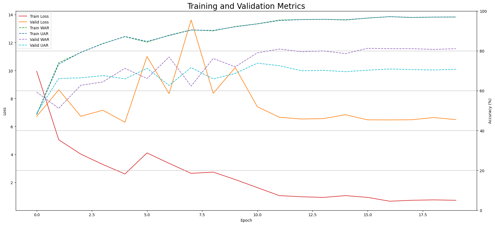
  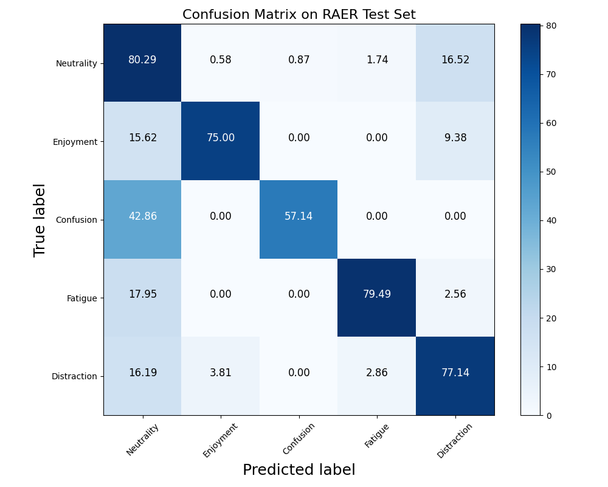
</p>

### Benchmark trên Dataset Khác

| Dataset | Classes | Metric | Score |
|---------|---------|--------|-------|
| **CAER-S** | 7 (Anger, Disgust, Fear, Happy, Neutral, Sad, Surprise) | UAR | **91.48%** |
| **EMOTIC** | 26 continuous emotion categories | mAP | **31.20%** |

#### CAER-S Results

<p align="center">
  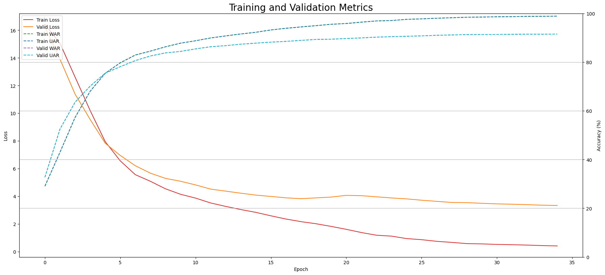
  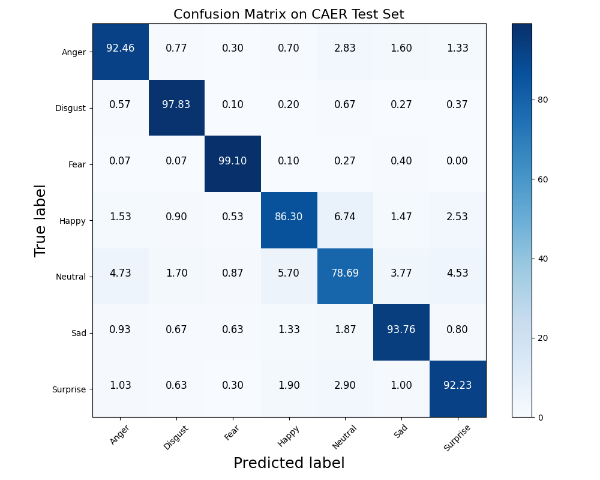
</p>

#### EMOTIC Results

<p align="center">
  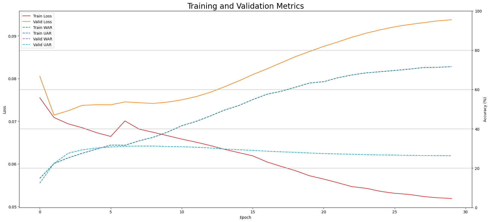
</p>

---

## 📊 Evaluation

### Đánh giá trên Test Set

```bash
python main.py \
  --mode eval \
  --dataset RAER \
  --eval-checkpoint outputs/RAER-ramp-down/model_best.pth \
  --test-annotation ./RAER/annotation/test.txt \
  --bounding-box-face ./RAER/bounding_box/face.json \
  --bounding-box-body ./RAER/bounding_box/body.json \
  --text-type prompt_ensemble \
  --crop-body
```

**Output:** Confusion matrix (`confusion_matrix.png`) + UAR/WAR metrics trong `log.txt`.

### Test-Time Augmentation (TTA)

TTA sử dụng nhiều augmented versions của mỗi test sample (flip, crop, color jitter...) rồi lấy trung bình predictions để cải thiện độ chính xác.

> **Lưu ý quan trọng:** Mặc dù `ramp-down` đạt UAR cao hơn `ramp-up` 0.05% trong standard evaluation, nhưng khi áp dụng TTA, **`ramp-up` lại cho kết quả cao hơn**. Điều này cho thấy model ramp-up generalize tốt hơn với các augmented inputs, trong khi ramp-down có thể hơi overfit vào distribution gốc.

```bash
# Chạy TTA trên model ramp-up (cho kết quả tốt nhất với TTA)
python eval_tta.py \
  --checkpoint outputs/RAER-ramp-up/model_best.pth \
  --dataset RAER \
  --test-annotation ./RAER/annotation/test.txt
```

Kết quả TTA:

<p align="center">
  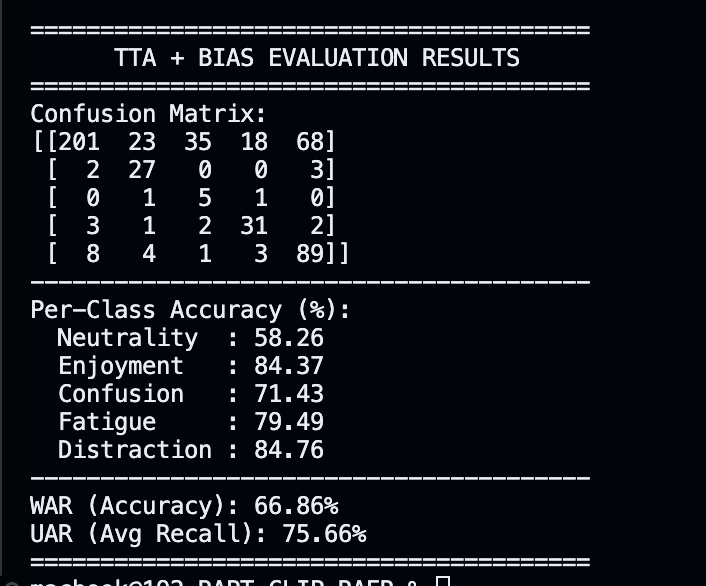
</p>

---

## 🔬 Visualization

### t-SNE — Phân tích Không Gian Đặc Trưng

So sánh feature space **trước** và **sau** fine-tune trên 528 test samples:

```bash
# Pretrained CLIP features (trước fine-tune)
python run_tsne_pretrained.py

# RAER model features (sau fine-tune)
python run_tsne_finetuned.py
```

#### Pretrained (trước fine-tune) → Các class trộn lẫn hoàn toàn

<p align="center">
  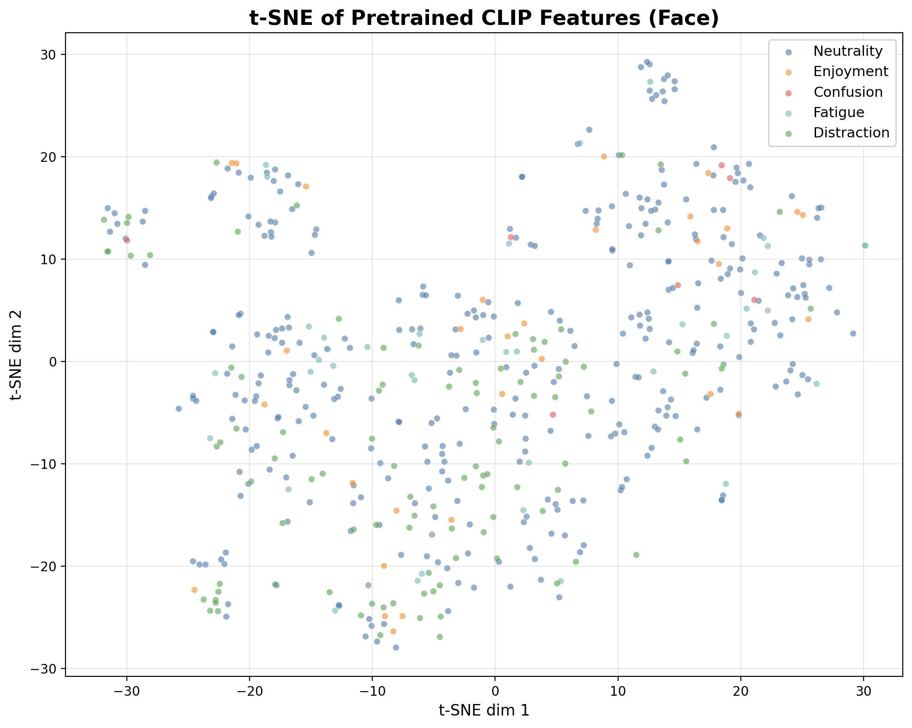
  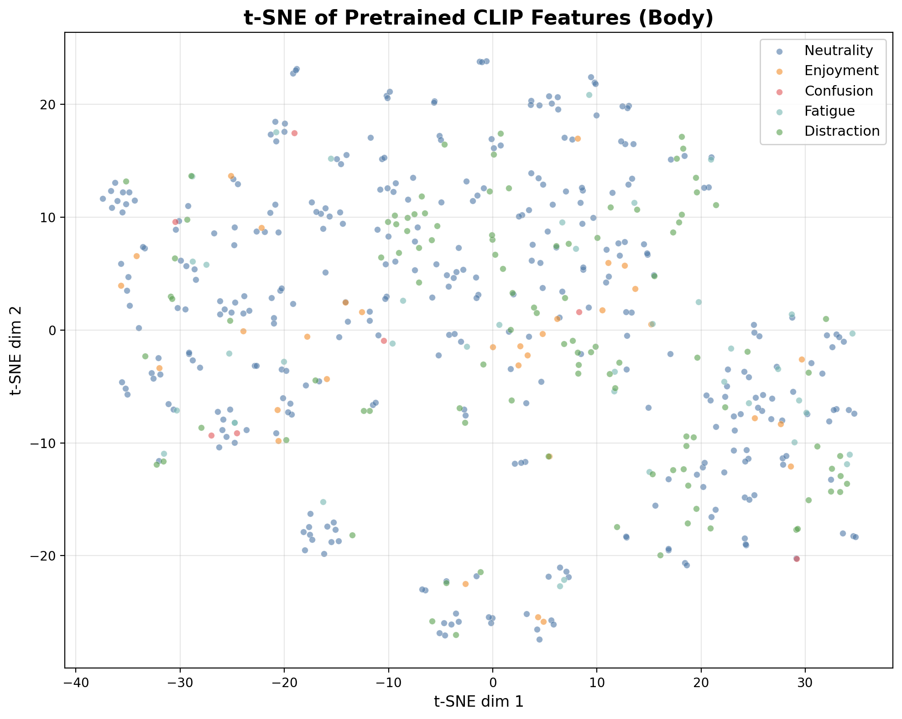
  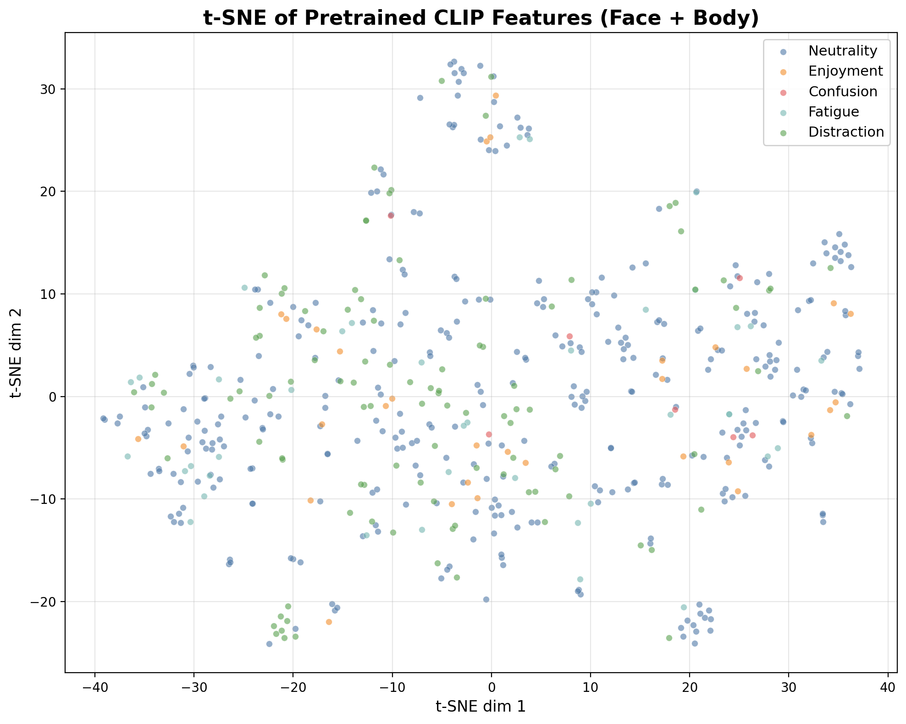
</p>

#### Fine-tuned (sau fine-tune) → Các class bắt đầu tách biệt rõ

<p align="center">
  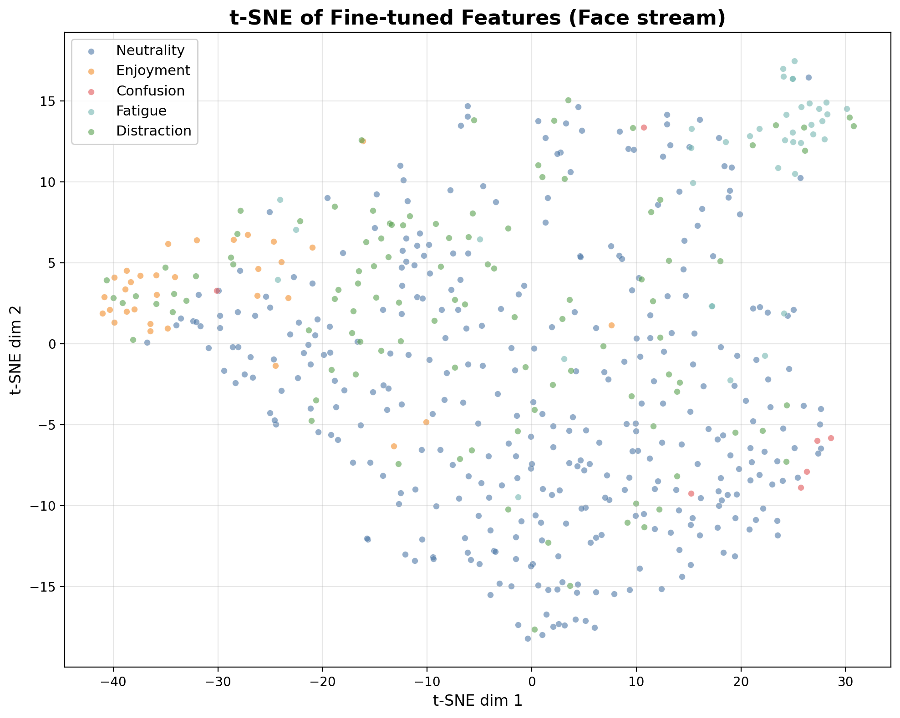
  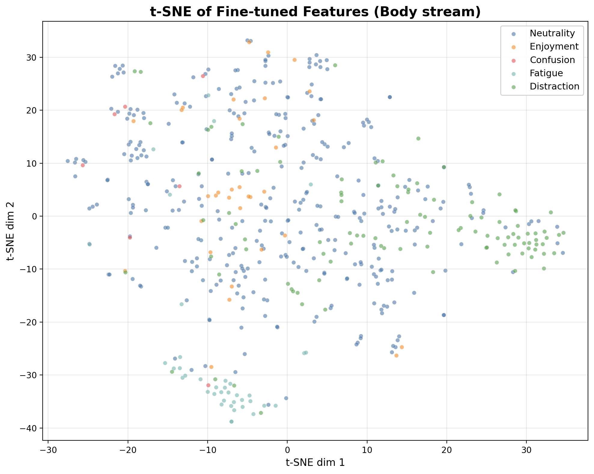
  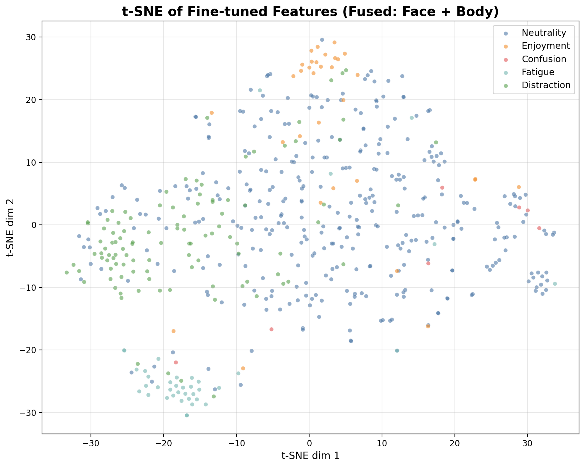
</p>

### GradCAM / Attention Heatmap

Sinh attention heatmap cho Face, Body, Context streams sử dụng **Token-level CLIP Similarity**:

```bash
python run_thesis_gradcam_v2.py
```

**Kỹ thuật:**
- Token-level cosine similarity giữa patch tokens (14×14) và text embedding
- Class-discriminative: trừ mean similarity → highlight vùng đặc trưng
- Face masking cho Body stream: chỉ focus torso/tay/vai

**Output:** `outputs/thesis_assets_v2/` — mỗi sample có GRID gồm: Original + Face Heatmap + Body Heatmap + Context Heatmap.

#### Ví dụ GradCAM cho 5 classes (tất cả predict đúng):

<p align="center">
  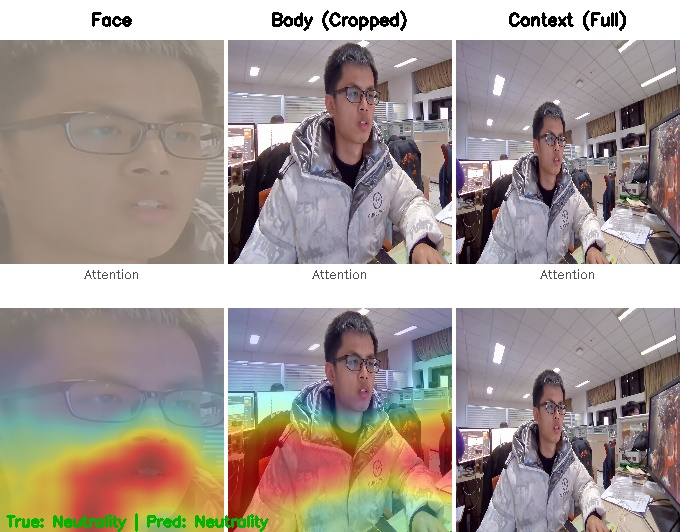
  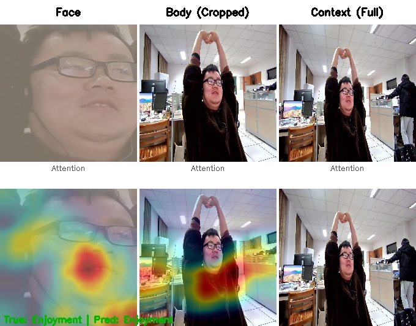
</p>
<p align="center">
  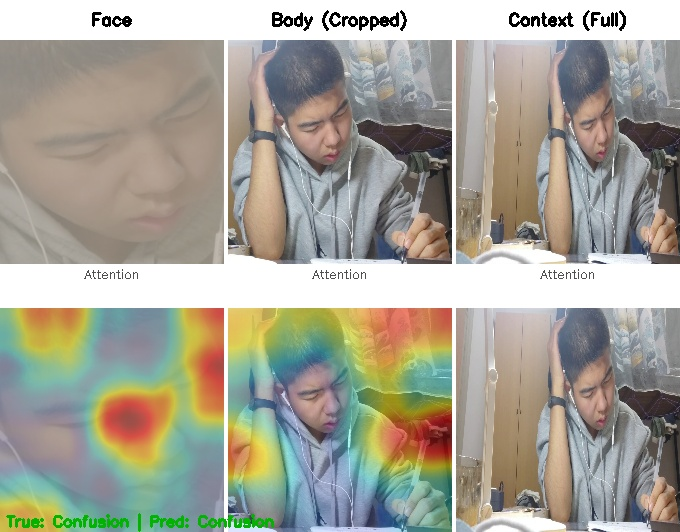
  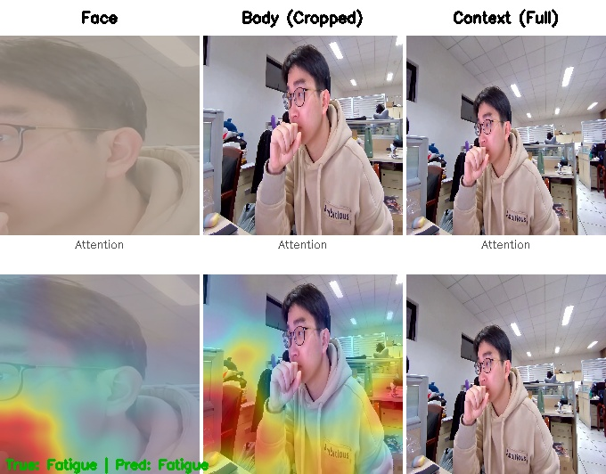
</p>
<p align="center">
  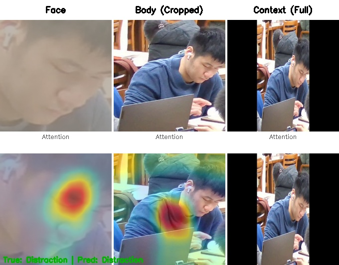
</p>

---

## 🎥 Real-time Emotion Recognition

Nhận diện cảm xúc qua webcam real-time, hỗ trợ nhiều người cùng lúc:

```bash
python realtime_gradcam.py --checkpoint outputs/RAER-ramp-down/model_best.pth
```

**Tính năng:**
- Haar Cascade face detection
- Batch inference cho nhiều người
- Multi-threaded (capture + inference song song)
- FPS counter + face persistence
- Nhấn `q` để thoát

> **Lưu ý (macOS):** Cần cấp quyền camera cho Terminal trong **System Settings → Privacy & Security → Camera**

---

## 🗂️ RAER Dataset

### Classes (5 loại cảm xúc học tập)

| ID | Class | Mô tả |
|----|-------|-------|
| 1 | **Neutrality** | Trung tính, bình tĩnh |
| 2 | **Enjoyment** | Thích thú, hào hứng |
| 3 | **Confusion** | Bối rối, khó hiểu |
| 4 | **Fatigue** | Mệt mỏi, buồn ngủ |
| 5 | **Distraction** | Mất tập trung, nhìn đi chỗ khác |

### Annotation Format

Mỗi dòng trong file annotation:
```
video_path num_frames label
```

Ví dụ:
```
RAER/videos/student01/clip_001 150 1
RAER/videos/student02/clip_003 120 4
```

### Bounding Box Format

File JSON chứa face/body bounding box cho từng frame:
```json
{
  "video_path/frame_001.jpg": [x1, y1, x2, y2],
  ...
}
```

---

## 📝 Citation

```bibtex
@misc{rapt-clip-raer-2026,
  title={Multimodal Academic Emotion Recognition with Vision-Language Pre-training},
  year={2026}
}
```

---

## 📄 License

This project is for academic research purposes.